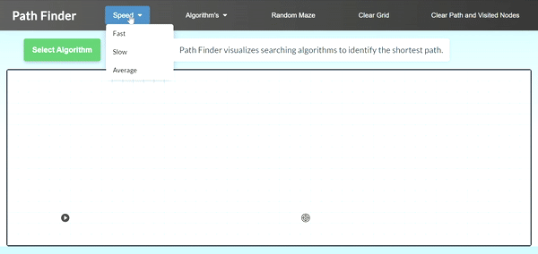

# Algorithm Visualizer

Algorithm Visualizer is an interactive web application for visualizing graph traversal and pathfinding algorithms. It provides an intuitive way to understand how different algorithms explore a graph step by step.

<p align="center">
  
</p>

---

## ✨ Features

- Visualize Breadth First Search (BFS)
- Visualize Depth First Search (DFS)
- Visualize Dijkstra's Algorithm
- Generate Random Mazes
- Adjustable visualization speed
- Drag and reposition start/end nodes
- Clear grid and reset paths
- Step-by-step animation

---

### Navigate to the project

```bash
cd Algoritm-Visualizer
```

### Run

Simply open **index.html** in your browser.

or

Use VS Code Live Server.

---

## 📂 Project Structure

```
├── index.html
├── style.css
├── scriptbasic.js
├── start.svg
├── end.svg
├── homeAnimation1.gif
├── icnon.png
└── README.md
```

---

## 🛠️ Technologies Used

- HTML5
- CSS3
- JavaScript (ES6)

---

## 📖 Algorithms Implemented

- Breadth First Search (BFS)
- Depth First Search (DFS)
- Dijkstra's Algorithm

---

## 🎯 Future Improvements

- A\* Search
- Greedy Best First Search
- Bidirectional Search
- Additional Maze Generation Algorithms
- Mobile Responsive UI

---

## 📸 Preview

<p align="center">
  
</p>

---
